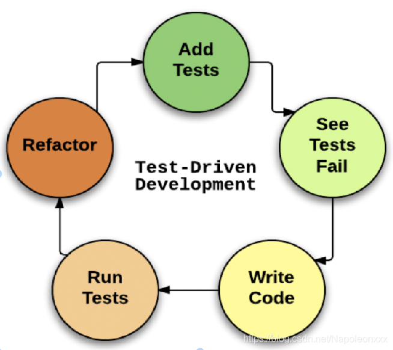

#### 初始化

```javascript
yarn init -y
```

#### 实现第一个测试用例

index.js

```javascript
var add = function(a){
  return 1 + a
}
```

index.spec.js

```javascript
describe('测试基本api',function(){
  it('add',function(){
    except(add(1)).toBe(2)
  })
})
```

#### 如何让上面的代码运行

安装karma测试框架

```javascript
yarn add -D karma
```

配置package.json可以执行karma命令，如果不想配置可以安装 karma-cli

```json
"scripts":{
  "karma-init":"karma init"
}
```

执行命令初始化

```bash
yarn karma-init
```

+ Which testing framework do you want to use?

想要使用的单元测试框架 jasmine

+ Do you want to use Require.js

是否想要用Requirejs， 不需要

+ Do you want to capture any browsers automatically？

想要自动调用的浏览器 PhantomJS

PhantomJS是一个可编程的无头浏览器:一个完整的浏览器内核,包括js解析引擎,渲染引擎,请求处理等,但是不包括显示和用户交互页面的浏览器。

hantomJS的适用范围就是无头浏览器的适用范围。通常无头浏览器可以用于页面自动化，网页监控，网络爬虫等：

页面自动化测试：希望自动的登陆网站并做一些操作然后检查结果是否正常。
网页监控：希望定期打开页面，检查网站是否能正常加载，加载结果是否符合预期。加载速度如何等。
网络爬虫：获取页面中使用js来下载和渲染信息，或者是获取链接处使用js来跳转后的真实地址

+ What is the location of your source and test files

想要测试的文件位置，暂时留空

+ Should any of the files included by the previous patterns be excluded？

想要排除哪些文件暂时留空

+ Do you want Karma to watch all the files and run the tests on change？

是否需要监听文件改变， 暂时选no,不监听

**下一步**

打开生成的karma.conf.js文件

```javascript
{
  // 测试框架名称
  frameworks: ['jasmine'],

  //测试文件目录
  files: [
    "./test/unit/**/*.js",
    "./test/unit/**/*.spec.js"
  ],

  singleRun:true
}
```

在package.json中添加运行命令

```javascript
 "scripts": {
  "karma-init": "karma init",
  "karma-start": "karma start"
}
```

安装无头浏览器和jasmine适配器

```javascript
yarn add -D karma-jasmine karma-phantomjs-launcher phantomjs
```

编写测试用例

index.js
```javascript
function add(a) {
  if (a == 1) {
    return a + 1;
  } else {
    return a + 2;
  }
}
```

index.spec.js
```javascript
describe('单元测试',function(){
  it("contains spec with an expectation", function() {
    expect(add(1)).toBe(2);
  })
})
```

执行 `karma-start` 进行单元测试



#### 覆盖率测试

安装 `karma-coverage`

```bash
yarn add -D karma-coverage
```

修改配置项

```javascript
{
  preprocessors: {
    "./test/unit/**/*.js":"coverage"
  },

  reporters: ['progress','coverage'],

  coverageReporter: {
    dir: 'doc/coverage',
    reporters: [
      // reporters not supporting the `file` property
      { type: 'html', subdir: 'report-html' },
    ]
  }
}
```

执行再次执行 `karma-start`

#### UI测试

安装 backstop

```bash
yarn add -D backstop
```

添加 package.json 命令行

```javascript
{
  "scripts": {
    "backstop-init": "backstop init",
    "backstop-start": "backstop test"
  }
}

```

执行 `backstop-init` 生成文件目录

修改文件目录配置

```javascript
{
  "id": "baidu",

  // 设计图分辨率设置
  "viewports": [
    {
      "label": "phone",
      "width": 375,
      "height": 667
    },
    {
      "label": "tablet",
      "width": 1024,
      "height": 768
    }
  ],

  //调用 puppeteer 库的脚本
  "onBeforeScript": "puppet/onBefore.js",
  "onReadyScript": "puppet/onReady.js",
  "scenarios": [
    {
      "label": "baidu home",
      "cookiePath": "backstop_data/engine_scripts/cookies.json",
      "url": "https://garris.github.io/BackstopJS/",
      "referenceUrl": "",
      "readyEvent": "",
      "readySelector": "",
      "delay": 0,
      "hideSelectors": [],
      "removeSelectors": [],
      "hoverSelector": "",
      "clickSelector": "",
      "postInteractionWait": 0,
      "selectors": [],
      "selectorExpansion": true,
      "expect": 0,
      "misMatchThreshold" : 0.1,
      "requireSameDimensions": true
    }
  ],
  "paths": {
    "bitmaps_reference": "backstop_data/bitmaps_reference",
    "bitmaps_test": "backstop_data/bitmaps_test",
    "engine_scripts": "backstop_data/engine_scripts",
    "html_report": "doc/backstop_data/html_report",
    "ci_report": "backstop_data/ci_report"
  },
  "report": ["browser"],
  "engine": "puppeteer",
  "engineOptions": {
    "args": ["--no-sandbox"]
  },
  "asyncCaptureLimit": 5,
  "asyncCompareLimit": 50,
  "debug": false,
  "debugWindow": false
}

```